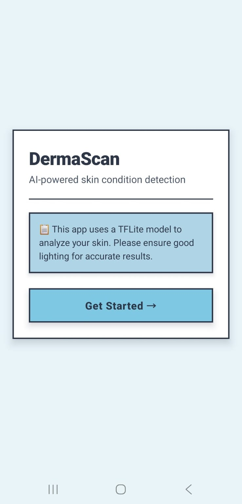

# 🧠 DermaScan – AI-Based Acne Severity Detection App

DermaScan is a mobile-ready deep learning application that classifies acne severity into **Mild, Moderate, and Severe** using a lightweight CNN model (MobileNetV2). The system is optimized for **on-device inference using TensorFlow Lite**, ensuring privacy and real-time performance.

---

## 🚀 Features

- 📷 Capture or upload skin images
- 🤖 AI-based acne severity classification
- 📊 Outputs severity + confidence score
- 📱 Runs offline using TFLite (no internet required)
- 🔒 Privacy-first (no data leaves device)
- 🌍 Optimized for Indian skin tones

---

## 🧠 Model Details

- Architecture: **MobileNetV2 (Transfer Learning)**
- Input Size: **224 × 224 RGB images**
- Classes:
  - Mild
  - Moderate
  - Severe
- Optimization: **TFLite Quantization**
- Dataset: **DermaCon-IN (Indian dataset)**

---

## 🔁 System Pipeline

**Steps:**
1. Image Capture / Upload  
2. Preprocessing (Resize + Normalize)  
3. Model Inference (MobileNetV2)  
4. Severity Prediction + Confidence  

---

## 🏗️ System Architecture

The system processes user input locally and returns acne severity without requiring cloud interaction.

---

## 📊 Data Flow Diagrams

### Level 0 DFD

### Level 1 DFD

---

## 🔄 Workflow (State Diagram)

---

## 🔧 Modules

- **User Interaction Module** → Capture/upload images  
- **Image Processing Module** → Resize, normalize  
- **Classification Module** → MobileNetV2 prediction  
- **On-Device Inference Module** → TFLite execution  

---

## 🧪 Testing

- ✅ Unit Testing (Preprocessing, Model, TFLite)
- ✅ Integration Testing (End-to-End pipeline)
- ⚡ Real-time performance tested (<2 seconds)

---

## 📱 Screenshots

  <table>
    <tr>
      <td align="center"><b>🏠 Home</b></td>
      <td align="center"><b>📤 Upload</b></td>
      <td align="center"><b>🖼️ Selected</b></td>
      <td align="center"><b>⚙️ Analyzing</b></td>
      <td align="center"><b>📊 Results</b></td>
    </tr>
    <tr>
      <td></td>
      <td></td>
      <td></td>
      <td></td>
      <td></td>
    </tr>
  </table>

## 🛠️ Tech Stack

- Python
- TensorFlow / Keras
- TensorFlow Lite
- OpenCV / PIL
- Android Studio
- Google Colab

---

## 👥 Team

- Abhirami Sajith
- Afia Nasumudeen
- Akshara Cheruvatheri
- Alex Mathai Mathews
